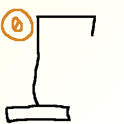

Algoritmos y Programación 2 - FI UBA

# Ejemplo de aplicación C++

## Descripción

Juego del ahorcado, construido como un ejemplo de aplicación desarrollada en C++.

## Fuentes

 * [`principal.cpp`](../Ahorcado/src/principal.cpp)
 * [`interacciones.h`](../Ahorcado/src/interacciones.h)
 * [`interacciones.cpp`](../Ahorcado/src/interacciones.cpp)
 * [`reglas.h`](../Ahorcado/src/reglas.h)
 * [`reglas.cpp`](../Ahorcado/src/reglas.cpp)
 * [`constantes.cpp`](../Ahorcado/src/constantes.cpp)
